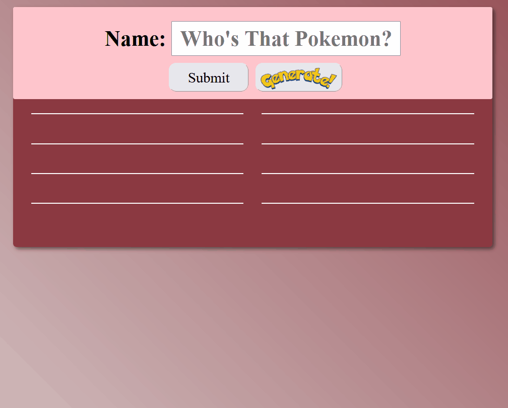

# My Awesome Project

Pulls from PokeAPI and displays information onto the interface. User input is checked against the name of the pokemon and displays a correct/incorrect response.

## Live Site

[Who's That Pokemon?](https://brandon-schefstad-pokemon.netlify.app/)

## How It's Made:

**Tech used:** HTML, CSS, JavaScript, Netlify
